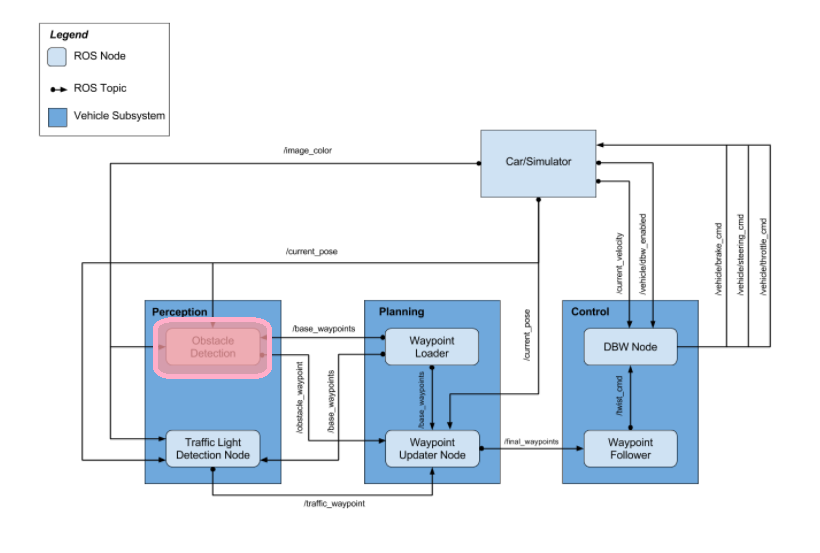
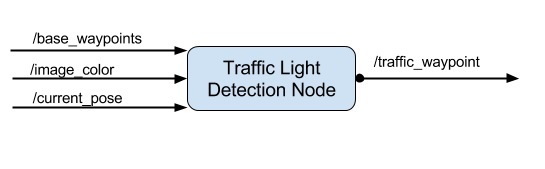
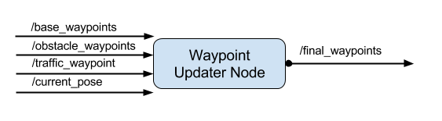
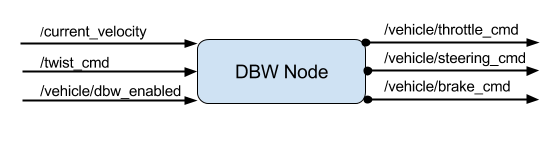

[video1]: results/video.mp4
# System Integration Project for CARLA

The goal of this project is the be able to implement self-driving functionality on a test track, given waypoints and sensor data, using ROS and Autoware. 


A sample video of the car passing the first and second traffic lights [video][video1]

## Architecture
The system architecture for this project is shown below. The topics and messages used in ROS are shown as arrows.



### Perception


In the project, there are no other cars and obstacles, so only the traffic light detection node is implemented. 
 
The traffic light detection node is implemented using the object detection models from [tensorflow github](https://github.com/tensorflow/models/tree/master/research/object_detection). Different models were tested, but I could only run the ssd_mobilenet_v1_feature_extractor model on my PC, and hence that was the model that was used. In order to utilize this model, the num_classess has to be changed to 4 (RED, YELLOW, GREEN and UNKNOWN).

In order to use the model, the first step was to get and label screenshots from the simulator and the real data set. I used the labeled data provided [here](https://becominghuman.ai/traffic-light-detection-tensorflow-api-c75fdbadac62) for this project. This data is fed to the NN and the results are saved in ros/src/tl_detector/model/tl_classifier.pb.

The detection system is a bit laggy and sometimes takes too long to recognize the traffic light changes. Different parameters were tested to improve the lagginess, but it still persists. 

### Planning


In the planning subsytem the current position of the car and the known waypoints are used to plan the next waypoints and velocity for the car. The waypoints are loaded in the Waypoint Loader Node provided by Udacity. It loads all the saved waypoints and publishes them to the /base_waypoints topic.

In the waypoint updater node, the traffic light waypoint positions are transformed into the vehicle's coordinates to find the closest traffic light to the vehicle's current position. When this is found, if the light is red or yellow we brake, if there are no traffic lights close, the car's velocity is set to /waypoint_loader/velocity. Braking is done by calculating the distance to where we plan to stop, then using a decelerator multiplier (line 107 in waypoint_updater.py) to decelarate smoothly. 

The car is set to stop around 2 meters before the actual stop line, to be on the safe side. 

Subscibest to:
* /base_waypoints: Waypoints are loaded to this topic in waypoint_loader, and contain the entire tracks waypoints. 
* /traffic_waypoint: This topic is used to to receive the closest red light to the car
* /current_pose: This topic is used to know where the car is
* /current_velocity: This topic is used to know the current velocity of the car.

Publishes to:
* /final_waypoints: The next waypoints that the car will go to (based on the base waypoints, traffic lights and speed). 

### Control


Waypoint follower was implemented by udacity, and is used to make the car follow the waypoints specified in /final_waypoints. 

The drive-by-wire (DBW) node is responsible for the accelaration, braking and steering of the vehicle. The node takes in the target linear and angular velocity and adjusts the throttle, steering and braking accordingly in twist_controller.py. The first step is to calculate the error (line 42 in twist_controller.py) between the proposed and current linear velocities. If the error is less than zero, this means we have to brake, and we brake proportionally to the max velocity, otherwise we feed the proposed and current linear velocities and angular velocity to a PID controller, with Kp=0.7, Ki=0.15, and Kd=0.25. 

Yaw controller is used to calculate the steering angle based on the current linear and angular velocities.

The PID controller resets when /vehicle/dbw_enabled is toggled (line 32 in twist_controller.py).

Subscribes to:
* /final_waypoints: The next waypoints that the car will go to (based on the base waypoints, traffic lights and speed). 
* /current_pose: This topic is used to know where the car is
* /current_velocity: This topic is used to know the current velocity of the car.
* /vehicle/dbw_enabled: To see if drive-by-wire is being used or a manual driver
* /twist_cmd: The target linear/angular velocity is provided here

Publishes to:
* /vehicle/throttle_cmd: Throttle for the car
* /vehicle/steering_cmd: Steering for the car
* /vehicle/brake_cmd: Brake for the car

## Issues and future work
There are still a couple of issues that need to be addressed for the car to move smoothly.

* The car tends to swing when braking at speeds close to zero, further parameter tweeking of the PID controller is needed. 
* The object detection tends to lag and sometimes misses the changing traffic light.
* The car is a bit jumpy at speeds close to zero. This was done on purpose to be able to steer the car when it swings.

---

### Installation

* Be sure that your workstation is running Ubuntu 16.04 Xenial Xerus or Ubuntu 14.04 Trusty Tahir. [Ubuntu downloads can be found here](https://www.ubuntu.com/download/desktop).
* If using a Virtual Machine to install Ubuntu, use the following configuration as minimum:
  * 2 CPU
  * 2 GB system memory
  * 25 GB of free hard drive space

  The Udacity provided virtual machine has ROS and Dataspeed DBW already installed, so you can skip the next two steps if you are using this.

* Follow these instructions to install ROS
  * [ROS Kinetic](http://wiki.ros.org/kinetic/Installation/Ubuntu) if you have Ubuntu 16.04.
  * [ROS Indigo](http://wiki.ros.org/indigo/Installation/Ubuntu) if you have Ubuntu 14.04.
* [Dataspeed DBW](https://bitbucket.org/DataspeedInc/dbw_mkz_ros)
  * Use this option to install the SDK on a workstation that already has ROS installed: [One Line SDK Install (binary)](https://bitbucket.org/DataspeedInc/dbw_mkz_ros/src/81e63fcc335d7b64139d7482017d6a97b405e250/ROS_SETUP.md?fileviewer=file-view-default)
* Download the [Udacity Simulator](https://github.com/udacity/CarND-Capstone/releases).

### Docker Installation
[Install Docker](https://docs.docker.com/engine/installation/)

Build the docker container
```bash
docker build . -t capstone
```

Run the docker file
```bash
docker run -p 4567:4567 -v $PWD:/capstone -v /tmp/log:/root/.ros/ --rm -it capstone
```

### Port Forwarding
To set up port forwarding, please refer to the [instructions from term 2](https://classroom.udacity.com/nanodegrees/nd013/parts/40f38239-66b6-46ec-ae68-03afd8a601c8/modules/0949fca6-b379-42af-a919-ee50aa304e6a/lessons/f758c44c-5e40-4e01-93b5-1a82aa4e044f/concepts/16cf4a78-4fc7-49e1-8621-3450ca938b77)

### Usage

1. Clone the project repository
```bash
git clone https://github.com/udacity/CarND-Capstone.git
```

2. Install python dependencies
```bash
cd CarND-Capstone
pip install -r requirements.txt
```
3. Make and run styx
```bash
cd ros
catkin_make
source devel/setup.sh
roslaunch launch/styx.launch
```
4. Run the simulator

### Real world testing
1. Download [training bag](https://drive.google.com/file/d/0B2_h37bMVw3iYkdJTlRSUlJIamM/view?usp=sharing) that was recorded on the Udacity self-driving car (a bag demonstraing the correct predictions in autonomous mode can be found [here](https://drive.google.com/open?id=0B2_h37bMVw3iT0ZEdlF4N01QbHc))
2. Unzip the file
```bash
unzip traffic_light_bag_files.zip
```
3. Play the bag file
```bash
rosbag play -l traffic_light_bag_files/loop_with_traffic_light.bag
```
4. Launch your project in site mode
```bash
cd CarND-Capstone/ros
roslaunch launch/site.launch
```
5. Confirm that traffic light detection works on real life images
